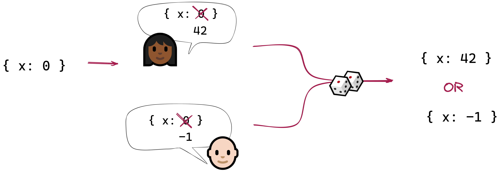

## A conflict-free, replicated state container

**crdx** is a **state container for JavaScript apps**. It's comparable to
[Redux](https://redux.js.org/), [MobX](https://mobx.js.org/README.html), or
[Recoil](https://recoiljs.org/), and it can be used in any framework ([React](https://reactjs.org/),
[Vue](https://vuejs.org/), [Svelte](https://svelte.dev/), etc.), or with no framework.

It is also a **CRDT** ([conflict-free replicated
datatype](https://en.wikipedia.org/wiki/Conflict-free_replicated_data_type)), allowing you to create
a [local-first](http://inkandswitch.com/local-first/) application that syncs state directly with
peers, with no need for a server.

## Why

A CRDT uses mechanical conflict-resolution rules to guarantee that **concurrent changes can always
be merged** _without_ human intervention — and _without_ a centralized server. Think Git, but
without the need to manually resolve merge conflicts; or operational transforms (OT), but without
the need for an authoritative server. CRDTs are exciting because they open up possibilities for
decentralized, peer-to-peer collaboration.

We already have excellent JavaScript CRDT libaries such as
[Automerge](https://github.com/automerge/automerge) and [Yjs](https://github.com/yjs/yjs). So what
does this project bring to the table?

### Custom conflict detection and resolution

Automerge and Yjs define a conflict as _two peers assigning different values to the same property_,
and they resolve conflicts by choosing one of the two values as the "winner", in an **arbitrary but
predictable** way.



This simple solution is good enough for a surprising number of applications, and if it works for
you, you should probably consider using Automerge or Yjs instead of this library.

But what a conflict involves more than one property? Or what if you have your own rules for
resolving conflicts? For example:

| Example&nbsp;domain                              | Domain-specific conflict                                                           | A possible rule for conflict resolution                                     |
| ------------------------------------------------ | ---------------------------------------------------------------------------------- | --------------------------------------------------------------------------- |
| **Group chat**                                   | Alice removes Bob from a group; concurrently, Bob removes Alice                    | To be safe, both Alice and Bob are removed                                  |
| **Scheduling meeting rooms**                     | Alice books a room from 2:00 to 4:00; concurrently, Bob books it from 3:00 to 5:00 | Alice gets the room because she is senior to Bob                            |
| **[Spit](https://cardgames.io/spit/) card game** | Alice and Bob concurrently try to play on top of the same card                     | To keep the game balanced, Bob wins the play because he has more cards left |

**Detecting conflicts** may be more subtle than just noticing when two users concurrently modify a
property. And **resolving conflicts** may involve requirements that won't let us just resolve
conflicts in an arbitrary way.

### A familiar programming model

If you’ve used a state container like Redux before, there’s a lot about CRDX that will be very
familiar. There’s a `createStore` function that initializes a store for your application state. Just
like a Redux store, you can **dispatch** named **actions** to it, and query it for its current
**state**. You provide a **reducer** function to calculate your current state from any sequence of
actions.

Redux works with an append-only list of actions. CRDX adds a couple of twists:

- To ensure each action’s authenticity, each one is cryptographically **signed** by its author.
- To ensure the integrity of the whole sequence of actions, each one is linked to the previous one
  by its cryptographic **hash**.
- To support peer-to-peer replication, we need to deal with concurrent changes, which means a simple
  append-only list of actions won’t be sufficient. Instead, we arrange actions in a directed acyclic
  **graph** (DAG).

This hash-chained and signed directed graph of actions is called a **hash graph**.

## How

```bash
yarn add crdx
```

Here is how you might use CRDX to implement a counter that only increments by one:

```js
import { createUser, createChain, createStore } from 'crdx'

const alice = createUser('alice')
const newChain = createChain({ name: 'counter', user: alice })

const counterReducer = (state, link) => {
  const action = link.body
  switch (action.type) {
    case 'ROOT':
      return { value: 0 }

    case 'INCREMENT':
      return {
        ...state,
        value: state.value + 1,
      }
  }
}

const store = createStore({
  chain: newChain,
  reducer: counterReducer,
  user: alice,
})

store.dispatch({ type: 'INCREMENT' })
store.dispatch({ type: 'INCREMENT' })

const state = store.getState()
console.log(state.value) // 2
```

#### The hash graph

A hash graph is an acyclic directed graph of links. Each link

- is **cryptographically signed** by the author; and
- includes a **hash of the parent link**.

This means that the chain is **append-only**: Existing nodes can’t be modified, reordered, or
removed without causing the hash and signature checks to fail.


A hash graph is just data and can be stored as JSON. It consists of a hash table of the links
themselves, plus a pointer to the **root** (the “founding” link added when the chain was created)
and the **head** (the most recent link we know about).

If Alice adds new links to the hash graph while disconnected from Bob, there’s no problem: When
they sync up, Bob will realize that he’s behind and he’ll get the latest links in the chain.

If Alice and Bob _both_ add new links to the signature while they’re disconnected from each other.
When they sync up, they each add a special **merge link**, pointing to their two divergent heads.
This merge link becomes the new head for both of them.


#### Users and keys

In order to sign actions dispatched to the store, CRDX needs to know the name and keys of the local
user. CRDX provides the `createUser` function to generate a user object with a new (randomly
generated) keyset in the correct format:

```js
const alice = createUser('alice')
```

The resulting object might look like this:

```js
{
  userName: 'alice',
  keys: {
    type: 'USER',
    name: 'alice',
    generation: 0,
    signature: {
      publicKey: '4BMEn...',
      secretKey: 'qE1Uh...',
    },
    encryption: {
      publicKey: 'FFKQr...',
      secretKey: 'w40go...',
    },
    secretKey: 'Bldq9...''
  }
}
```

You’ll need to store this information securely once it’s been generated.

CRDX doesn’t keep track of any other users’ names or public keys — you’ll need to ensure that Alice
has some way of knowing what Bob’s public signature key is.

> If you don't already have a way to manage users' secret keys and verify their public keys, you
> might be interested in [@localfirst/auth](https://github.com/local-first-web/auth). This library
> uses CRDX internally to manage group membership and permissions, and keeps track of each member’s
> public keys on the hash graph itself.

#### The resolver function

Like Redux, CRDX uses a **reducer** to calculate the current state from a sequence of actions. But
we’re working with a directed graph, not a sequence. To flatten the hash graph’s graph of
actions into a single sequence, you provide a **resolver** function that defines how any two
concurrent sequences will be merged. This is where you implement any domain-specific
conflict-resolution logic.

Suppose you have the following graph. Actions **c** and **d** are made concurrently.


Your resolver will decide what to do with these concurrent actions: How they're ordered, and which ones to keep. It might

- take **c** before **d**
- take **d** before **c**
- take **d** and discard **c** altogether
- etc.

A resolver consists of two functions: A **sort** function, and a **filter** function.

TODO example

#### The reducer function

TODO
